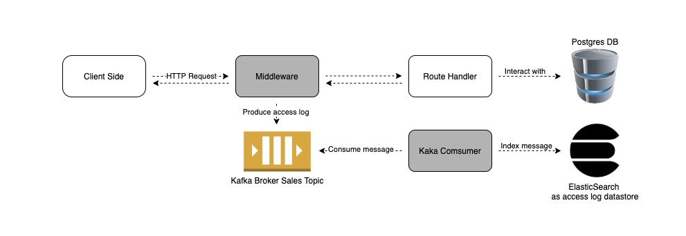
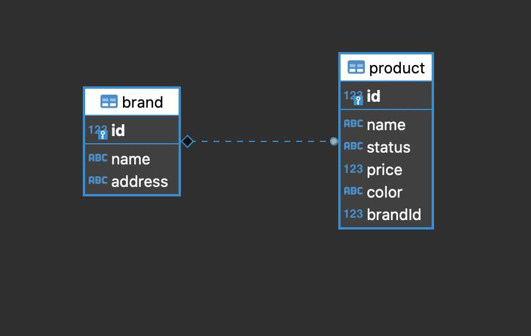
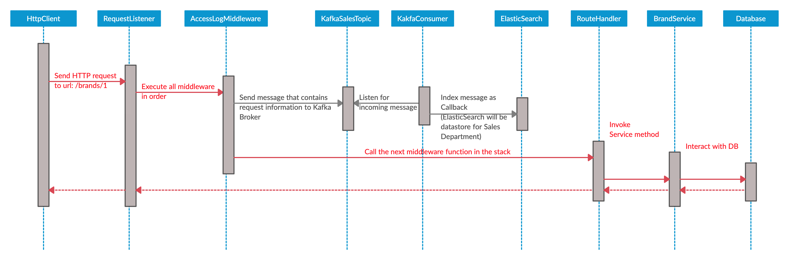
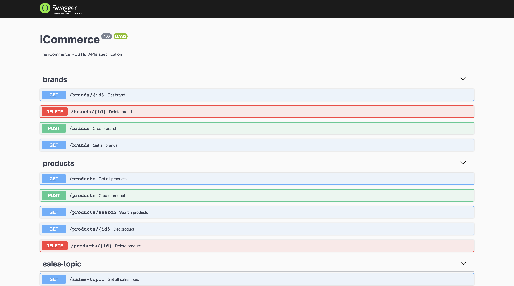

# nodejs-project

This project is for "iCommerce" start-up


<!-- TABLE OF CONTENTS -->
## Table of Contents

* [About the Project](#about-the-project)
  * [Built With](#built-with)
  * [Code Folder Structure](#code-folder-structure)
* [System Architecture](#system-architecture)
* [Getting Started](#getting-started)
  * [Prerequisites](#prerequisites)
  * [Installation and Running](#installation-and-running)
* [Usage](#usage)
* [License](#license)
* [Contact](#contact)


<!-- ABOUT THE PROJECT -->
## About The Project

This product is for NAB Development Challenge.

Here are what I will build:
* <b>RESTful</b> API using NodeJS (obviously :smile: ). I am going to using <b>Nest</b> ([NestJS](https://nestjs.com/)) framework with Express under the hood. FYI, Nest is built with and fully supports TypeScript and  and combines elements of OOP (Object Oriented Programming), and FRP (Functional Reactive Programming).
* Some CRUD services take advantage of on various aspects of <b>Dependency Injection</b> (DI) fundamentals and <b>Decorators</b> in TS (has same concept as Spring Boot :flushed: ).
* Event-based message microservice <b>Kafka Producer and Consumer</b>
* <b>ElasticSearch</b> as Time Series access log data store.
* The standardized <b>OpenAPI specification</b> to describe the application RESTful APIs.
* Continuous Integration (CI) workflow to test my Node.js project, also lint checks and unit testing as pre-commit, pre-push git hooks to improve my commit using [husky](https://github.com/typicode/husky). Thanks to free <b>Github Actions</b> plan
* Containerize system components to multi-container Docker applications with <b>Docker Compose</b>

This assignment, due to time constraints, just aim to demonstrate how it should work to meet the requirement.

### Built With
All major frameworks that I built my project using:
* [Nest](https://github.com/nestjs/nest)
* [Jest](https://github.com/facebook/jest)
* [KafkaJS](https://github.com/tulios/kafkajs)
* [Elasticsearch Official Node.js client](https://www.npmjs.com/package/@elastic/elasticsearch)
* [husky](https://github.com/typicode/husky)

### Code Folder Structure

    .
    ├── .github/             
    │   ├── workflows/                        # Metadata YAML syntax for GitHub Actions   
    ├── src/                                # Source code into individual module units
    │   ├── brands/                           # Brands Module managing Brands Resource
    │   │   ├── dto/                            # Data transfer objects for Brand entity
    │   │   ├── brand.entity.ts                 # Brand Entity Class
    │   │   ├── brand.repository.ts             # Repository of Brand entity
    │   │   ├── brands.controller.spec.ts       # Unit tests for Brand controller
    │   │   ├── brands.controller.ts            # Controller for Brands resource
    │   │   ├── brands.module.ts                # Brand Module
    │   │   ├── brands.service.spec.ts          # Unit tests for Brand service
    │   │   └── brands.service.ts               # Brand Service Managing Brands Source in DB
    │   ├── common/                           # Application-wide shared classes
    │   │   └── ...      
    │   ├── config/                           # Application-wide configuration variables
    │   │   └── ...         
    │   ├── consumer/                         # Kafka Consumer Module
    │   │   └── ...        
    │   ├── es/                               # ElasticSearch Module
    │   │   └── ...       
    │   ├── interceptors/                     # Application-wide Interceptors
    │   │   └── ...           
    │   ├── kafka/                            # Kafka Abstraction Module
    │   │   └── ...             
    │   ├── producer                          # Kafka Producer Module
    │   │   └── ...             
    │   ├── products/                         # Products Module managing Products Resource        
    │   │   ├── pipes/                          # eg: Validation Pipe classes for Products Entity
    │   │   └── ...
    │   └── app.module.ts                     # Root Module
    │   └── main.ts                           # The entry point of application
    ├── test/                               # end-to-end (e2e) testing module
    ├── Dockerfile                          # Dockerfile for API service
    ├── docker-compose.yml                  # Compose config file defining container services
    ├── package.json                        # 
    └── ...


<!-- System Architecture -->
## System Architecture

The formal description and representation of this application, organized in a way that supports reasoning about the structures and behaviors of the system.



* Entity relationship diagram



I will use 2 entities Product and Brand (where Brand contains multiple instances of Product, but Product contains only one instance of Brand), and keep them as simple as possible to create a few CRUD APIs, since my goal is just how I will apply software development principles like DRY..., to this project.

* Sequence diagram for API get Brand by its ID: <b>/brands/1</b>




<!-- GETTING STARTED -->
## Getting Started

Some instructions on setting up this project locally.
To get a local copy up and running follow these simple example steps.


### Prerequisites

Since this project was developed with docker compose to help define and share multi-container applications. <b style="color: red">Docker and Compose will come along, so please make sure that docker was installed locally. </b>
Refer to the following [link](https://docs.docker.com/get-docker/)


### Installation and Running

1. Clone source code from GitHub
```sh
git clone https://github.com/HarryMarch/nodejs-project
```
*NPM packages will be installed inside docker image so you don't need run <span style="color: brown">npm install</span> command*

2. Navigate to source code directory
```sh
cd nodejs-project/
```

3. Start Docker Compose
```sh
docker-compose up
```
*- Consider using <b>-d</b> option to keep you console screen clean <span style="color: brown">docker-compose up</span>*
*- It will take some time to pull needed docker images and build api image.*
*- Since API container will exposed to the host machine to port <b>3000</b>, port conflict may be trouble ahead.*

To verify that the application is running, open link http://localhost:3000/api in your web browser to visualize and interact with the API’s resources without having any of the implementation logic in place or any required http client like cURL, Postman...

4. Stop Docker Compose
```sh
docker-compose down
```


<!-- USAGE EXAMPLES -->
## Usage

It exposes API description through an OpenAPI specification and you can test application APIs via a user-friendly UI named Swagger UI. Please open link http://localhost:3000/api. It looks like:




<!-- LICENSE -->
## License

Distributed under the MIT License. See `LICENSE` for more information.


<!-- CONTACT -->
## Contact

Harry March - [@TikTok](https://www.tiktok.com/en/) - harrymarch21@gmail.com
